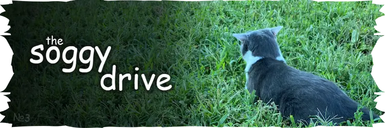
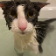

<h3>heyo!! hey!!! </h3>

this repo powers the image host at <a href="https://mirror.guweh.com">mirror.guweh.com</a>.

<table>
  <tr>
    <td><b>images</b></td>
    <td><b>videos</b></td>
    <td><b>thumbnails</b></td>
  </tr>
  <tr>
    <td>mirror.guweh.com/images.json
        mirror.guweh.com/*</td>
    <td>mirror.guweh.com/videos.json
        mirror.guweh.com/vids/*</td>
    <td>mirror.guweh.com/webp.json
        mirror.guweh.com/webp/*
        mirror.guweh.com/webp/vids/*</td>
  </tr>
</table>

for the sog drive interface see <a href="https://github.com/ssoggycat/drive-site">ssoggycat/drive-site</a>.
