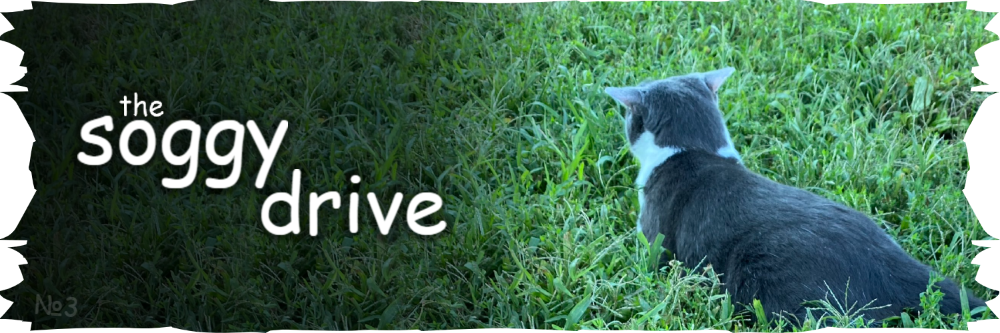

#### heyo!! hey!!!

this is a google drive for all known images of shark. biscuit, the owner, vanished from the internet and we are now trying to find any remaining photos taken of the cat..

the current search is mostly halted, as after [searching through all of the web archives](https://twitter.com/cvsilly_/status/1892986721408598310) there are no candidates for places to search through.. still, there are fixes / missed images being uploaded from time to time

you can leave comments on images if you'd like!

[drive #1 (by lily](https://drive.sogfulday.today)) - [drive #2 (by cv](https://drive2.sogfulday.today))

[discord](https://discord.gg/soggycat) // [twitter](https://twitter.com/ssoggycat) // [other](https://s.soggy.cat)

---

##### **file names**

each image has a random self-explanatory name (or an inside joke) assigned for convenience.   
despite keeping the exact same data, all of the .jpeg files should be renamed to .jpg to be compatible with other services. if there are any jpegs that i missed then mention me on [soggy world](https://discord.gg/soggycat)!!

##### **quality**

there are so many shark images that new ones sometimes get found in the most bizzare places, or might just not be fully processed in the web archives. that's why the uploads here might have really low resolution. check google lens / messages on soggy world, there might be higher quality versions just laying out there

##### **image-specific**

*(uncropped)* - a lower quality image but with less / no space around it cropped.  
*(hq)* - a notable higher quality version. they're mostly unlabeled

*"IT'S SNOWING IT'S SNOWING IT'S SNOWING.png"* was taken from biscuit's old tiktok video and has the file name as the caption. i've included a captionless image (*gulp* ai cleanup..) since that one is used more often

*“wire.mp4”* was ripped from a now deleted youtube video named “soggy cat found footage”, that’s why there was a siren going off  
it was found by marcus3205, and is now replaced with the full quality video

---

ssoggycat software division (2022-2026)